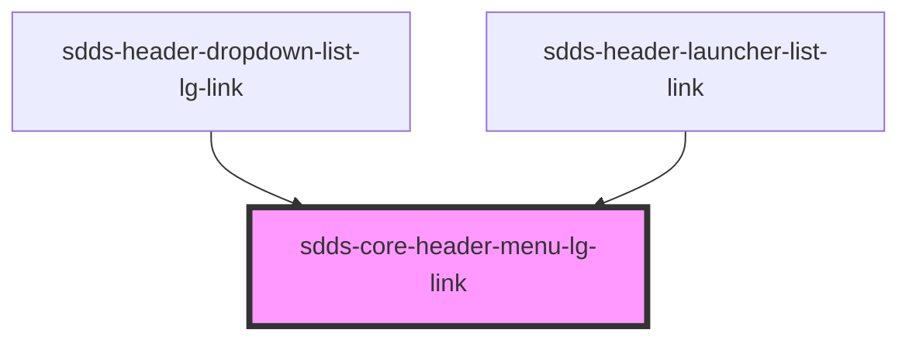

# sdds-header-launcher-list-link

<!-- Auto Generated Below -->

## Properties

| Property            | Attribute  | Description                                                                                                 | Type      | Default      |
| ------------------- | ---------- | ----------------------------------------------------------------------------------------------------------- | --------- | ------------ |
| `download`          | `download` | Native &lt;a&gt; tag attribute, see https://developer.mozilla.org/en-US/docs/Web/HTML/Element/a#attributes. | `string`  | `undefined`  |
| `href` _(required)_ | `href`     | The link URL                                                                                                | `string`  | `undefined`  |
| `hreflang`          | `hreflang` | Native &lt;a&gt; tag attribute, see https://developer.mozilla.org/en-US/docs/Web/HTML/Element/a#attributes. | `string`  | `undefined`  |
| `rel`               | `rel`      | Native &lt;a&gt; tag attribute, see https://developer.mozilla.org/en-US/docs/Web/HTML/Element/a#attributes. | `string`  | `'noopener'` |
| `selected`          | `selected` | If the link should appear selected.                                                                         | `boolean` | `false`      |
| `target`            | `target`   | Native &lt;a&gt; tag attribute, see https://developer.mozilla.org/en-US/docs/Web/HTML/Element/a#attributes. | `string`  | `undefined`  |

## Shadow Parts

| Part  | Description |
| ----- | ----------- |
| `"a"` |             |

## Dependencies

### Used by

 - [sdds-header-dropdown-list-lg-link](../header-dropdown-list-lg-link)
 - [sdds-header-launcher-list-link](../header-launcher-list-link)

### Graph

----------------------------------------------

*Built with [StencilJS](https://stenciljs.com/)*
