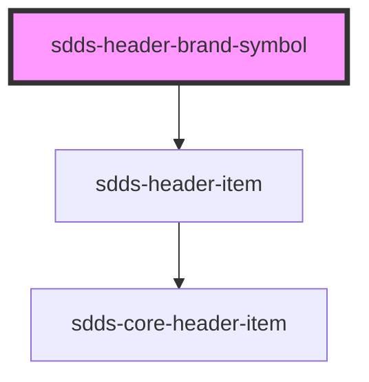

# sdds-header-brand-symbol

Note: Any aria attributes will be passed to the underlying anchor tag.

<!-- Auto Generated Below -->

## Properties

| Property   | Attribute   | Description                 | Type     | Default                    |
| ---------- | ----------- | --------------------------- | -------- | -------------------------- |
| `linkHref` | `link-href` | The href for the logo link. | `string` | `'https://www.scania.com'` |

## Dependencies

### Depends on

- [sdds-header-item](../header-item)

### Graph

----------------------------------------------

*Built with [StencilJS](https://stenciljs.com/)*
