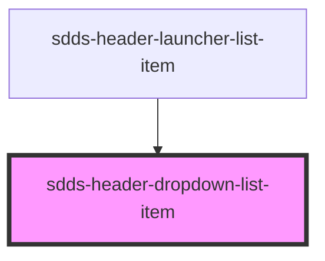

# sdds-header-dropdown-list-item

The header dropdown list item is a component that can be used to display a item in a header dropdown list.

<!-- Auto Generated Below -->

## Properties

| Property   | Attribute  | Description                         | Type           | Default |
| ---------- | ---------- | ----------------------------------- | -------------- | ------- |
| `selected` | `selected` | If the link should appear selected. | `boolean`      | `false` |
| `type`     | `type`     | The type of the list.               | `"lg" \| "md"` | `'md'`  |

## Dependencies

### Used by

 - [sdds-header-launcher-list-item](../header-launcher-list-item)

### Graph

----------------------------------------------

*Built with [StencilJS](https://stenciljs.com/)*
