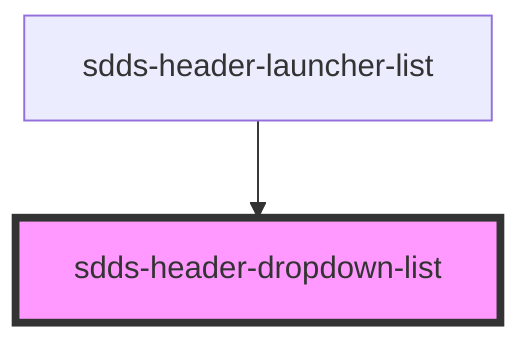

# sdds-header-dropdown-list

The header dropdown list should wrap a dropdowns list items.

<!-- Auto Generated Below -->

## Properties

| Property | Attribute | Description | Type           | Default |
| -------- | --------- | ----------- | -------------- | ------- |
| `type`   | `type`    |             | `"lg" \| "md"` | `'md'`  |

## Dependencies

### Used by

 - [sdds-header-launcher-list](../header-launcher-list)

### Graph

----------------------------------------------

*Built with [StencilJS](https://stenciljs.com/)*
