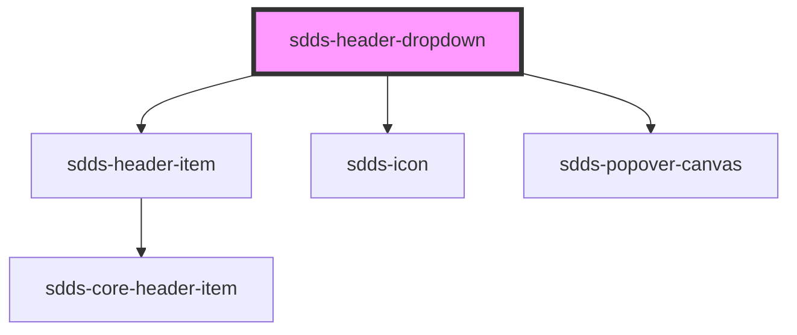

# sdds-header-dropdown

The header dropdown should contain content will be shown in a popover canvas when its button is clicked.

Example:

```html
<sdds-header-dropdown>
  <span slot="button-label">Label</span>
  <sdds-header-dropdown-list>
    <sdds-header-dropdown-list-item>
      <a href="https://www.scania.com">
        Link 1
      </a>
    </sdds-header-dropdown-list-item>
    <sdds-header-dropdown-list-item>
      <a href="https://www.scania.com">
        Link 2
      </a>
    </sdds-header-dropdown-list-item>
  </sdds-header-dropdown-list>
</sdds-header-dropdown>
```


<!-- Auto Generated Below -->


## Properties

| Property         | Attribute          | Description                                                                                       | Type      | Default     |
| ---------------- | ------------------ | ------------------------------------------------------------------------------------------------- | --------- | ----------- |
| `buttonLabel`    | `button-label`     | The label of the button that opens the dropdown. This is an alternative to the button-label slot. | `string`  | `undefined` |
| `noDropdownIcon` | `no-dropdown-icon` | If the dropdown icon (downwards chevron) should be hidden.                                        | `boolean` | `false`     |
| `selected`       | `selected`         | If the button that opens the dropdown should appear selected.                                     | `boolean` | `false`     |


## Dependencies

### Depends on

- [sdds-header-item](../header-item)
- [sdds-icon](../../../icon)
- [sdds-popover-canvas](../../../popover-canvas)

### Graph


----------------------------------------------

*Built with [StencilJS](https://stenciljs.com/)*
