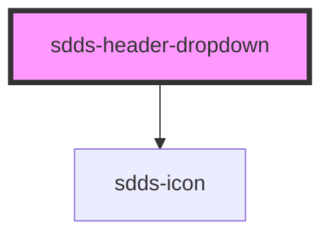

# sdds-header-dropdown

<!-- Auto Generated Below -->

## Properties

| Property         | Attribute          | Description                   | Type      | Default |
| ---------------- | ------------------ | ----------------------------- | --------- | ------- |
| `active`         | `active`           |                               | `boolean` | `false` |
| `noDropdownIcon` | `no-dropdown-icon` |                               | `boolean` | `false` |
| `open`           | `open`             | Opens and closes the dropdown | `boolean` | `false` |
| `wide`           | `wide`             |                               | `boolean` | `false` |

## Events

| Event              | Description | Type               |
| ------------------ | ----------- | ------------------ |
| `childOpenedEvent` |             | `CustomEvent<any>` |

## Methods

### `toggleDropdown() => Promise<void>`

#### Returns

Type: `Promise<void>`

## Dependencies

### Depends on

- [sdds-icon](../../../icon)

### Graph

----------------------------------------------

*Built with [StencilJS](https://stenciljs.com/)*
