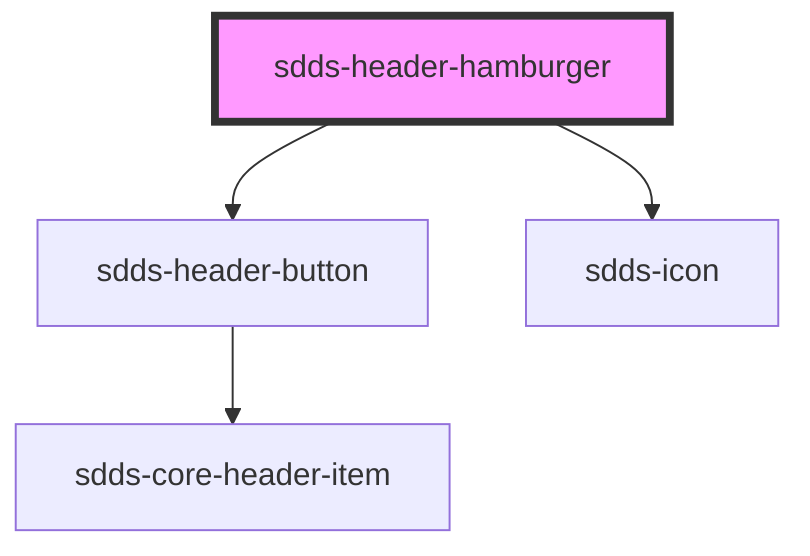

# sdds-header-hamburger

The header hamburger is a button that should be used to open the side menu.

Example:

```html
// HTML
<sdds-header-hamburger onclick="getElementById('sidemenu').open = true;"></sdds-header-hamburger>


// React JSX
<sdds-header-hamburger 
  onClick={() => {
    setSideMenuOpen(true);
  }}
>
</sdds-header-hamburger>
```


<!-- Auto Generated Below -->


## Dependencies

### Depends on

- [sdds-header-button](../header-button)
- [sdds-icon](../../../icon)

### Graph


----------------------------------------------

*Built with [StencilJS](https://stenciljs.com/)*
