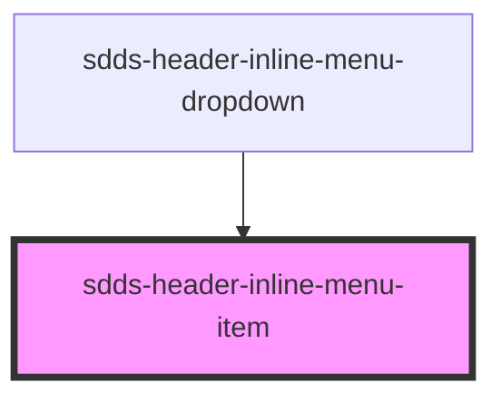

# sdds-header-inline-menu-item

<!-- Auto Generated Below -->

## Properties

| Property | Attribute | Description | Type                 | Default    |
| -------- | --------- | ----------- | -------------------- | ---------- |
| `href`   | `href`    |             | `string`             | `''`       |
| `text`   | `text`    |             | `string`             | `''`       |
| `type`   | `type`    |             | `"button" \| "link"` | `'button'` |

## Dependencies

### Used by

 - [sdds-header-inline-menu-dropdown](../header-inline-menu-dropdown)

### Graph

----------------------------------------------

*Built with [StencilJS](https://stenciljs.com/)*
