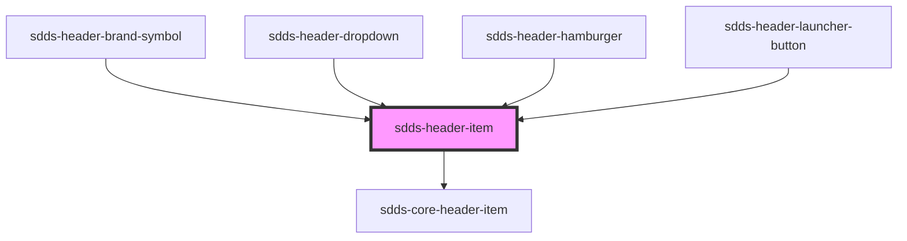

# sdds-header-item

The header item is a wrapper that styles a button or link in the header. For accessibility purposes it also serves as the element with the 'listitem' role in the header (the role is applied automatically).

Example:

```html
// HTML - button
<sdds-header-item>
  <button onclick="alert('About us clicked');">
    About us
  </button>
</sdds-header-item>

// HTML - link
<sdds-header-item>
  <a href="https://www.scania.com">
    About us
  </a>
</sdds-header-item>

// React JSX - button
<sdds-header-item>
  <button onClick={() => {
    alert('About us clicked');
  }}>
    About us
  </button>
</sdds-header-item>

```

Note: Any aria attributes will be passed to the underlying button tag.

<!-- Auto Generated Below -->


## Properties

| Property   | Attribute  | Description                                                                                                                      | Type      | Default |
| ---------- | ---------- | -------------------------------------------------------------------------------------------------------------------------------- | --------- | ------- |
| `active`   | `active`   | If the button should appear active. Can be used when the button is triggering a dropdown, and the dropdown is open, for example. | `boolean` | `false` |
| `selected` | `selected` | If the button should appear selected.                                                                                            | `boolean` | `false` |


## Dependencies

### Used by

 - [sdds-header-brand-symbol](../header-brand-symbol)
 - [sdds-header-dropdown](../header-dropdown)
 - [sdds-header-hamburger](../header-hamburger)
 - [sdds-header-launcher-button](../header-launcher-button)

### Depends on

- [sdds-core-header-item](../core-header-item)

### Graph


----------------------------------------------

*Built with [StencilJS](https://stenciljs.com/)*
