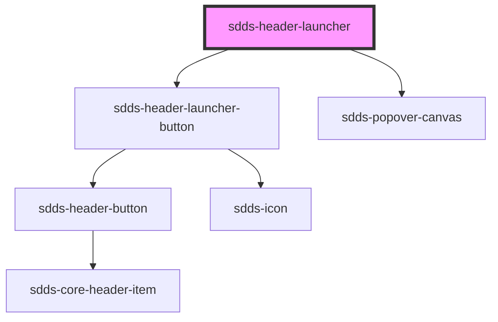

# sdds-header-launcher

<!-- Auto Generated Below -->

## Properties

| Property | Attribute | Description                   | Type      | Default |
| -------- | --------- | ----------------------------- | --------- | ------- |
| `open`   | `open`    | Opens and closes the launcher | `boolean` | `false` |

## Dependencies

### Depends on

- [sdds-header-launcher-button](../header-launcher-button)
- [sdds-popover-canvas](../../../popover-canvas)

### Graph

----------------------------------------------

*Built with [StencilJS](https://stenciljs.com/)*
