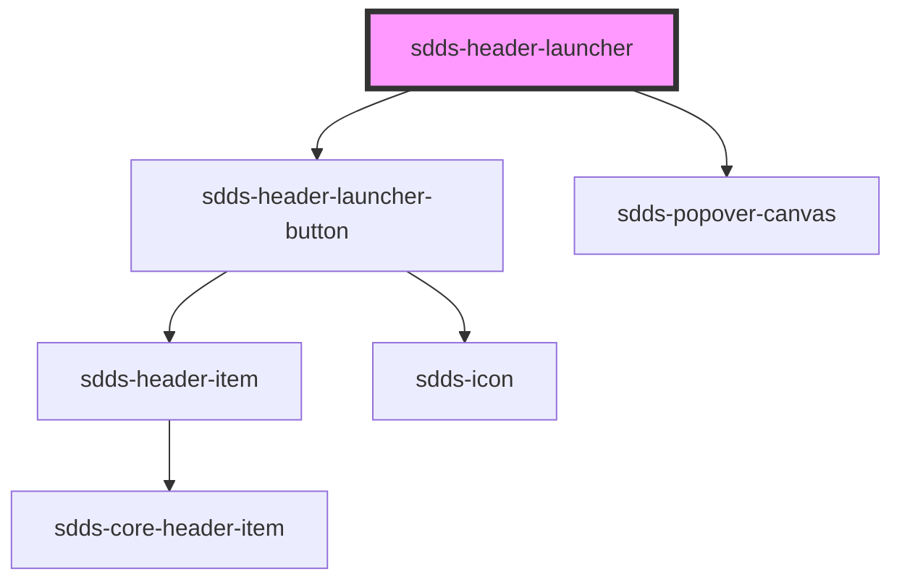

# sdds-header-launcher

See the [basic navigation pattern](/docs/patterns-navigation--basic) for an example of using the header launcher.

The [navigation pattern with few items](/docs/patterns-navigation--few-navigation-items) shows how you can implement an alternative grid layout for the header launcher.

<!-- Auto Generated Below -->

## Dependencies

### Depends on

- [sdds-header-launcher-button](../header-launcher-button)
- [sdds-popover-canvas](../../../popover-canvas)

### Graph

----------------------------------------------

*Built with [StencilJS](https://stenciljs.com/)*
