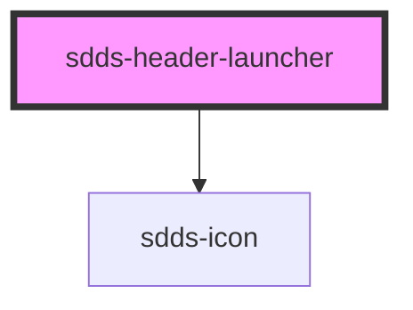

# sdds-header-launcher

<!-- Auto Generated Below -->

## Properties

| Property  | Attribute | Description                   | Type               | Default  |
| --------- | --------- | ----------------------------- | ------------------ | -------- |
| `open`    | `open`    | Opens and closes the launcher | `boolean`          | `false`  |
| `variant` | `variant` |                               | `"grid" \| "list"` | `'list'` |

## Events

| Event              | Description | Type               |
| ------------------ | ----------- | ------------------ |
| `childOpenedEvent` |             | `CustomEvent<any>` |

## Methods

### `toggleLauncher() => Promise<void>`

#### Returns

Type: `Promise<void>`

## Dependencies

### Depends on

- [sdds-icon](../../../icon)

### Graph

----------------------------------------------

*Built with [StencilJS](https://stenciljs.com/)*
