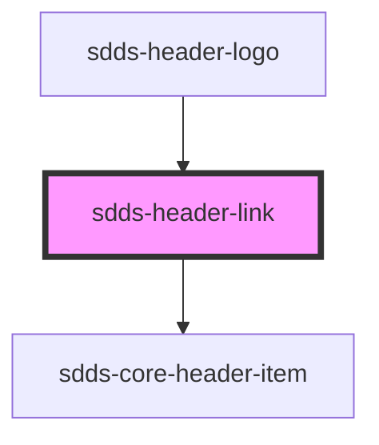

# sdds-header-link-alt

<!-- Auto Generated Below -->

## Properties

| Property            | Attribute    | Description | Type      | Default      |
| ------------------- | ------------ | ----------- | --------- | ------------ |
| `href` _(required)_ | `href`       |             | `string`  | `undefined`  |
| `persistent`        | `persistent` |             | `boolean` | `undefined`  |
| `rel`               | `rel`        |             | `string`  | `'noopener'` |
| `target`            | `target`     |             | `string`  | `undefined`  |

## Shadow Parts

| Part  | Description |
| ----- | ----------- |
| `"a"` |             |

## Dependencies

### Used by

 - [sdds-header-logo](../header-logo)

### Depends on

- [sdds-core-header-item](../core-header-item)

### Graph

----------------------------------------------

*Built with [StencilJS](https://stenciljs.com/)*
