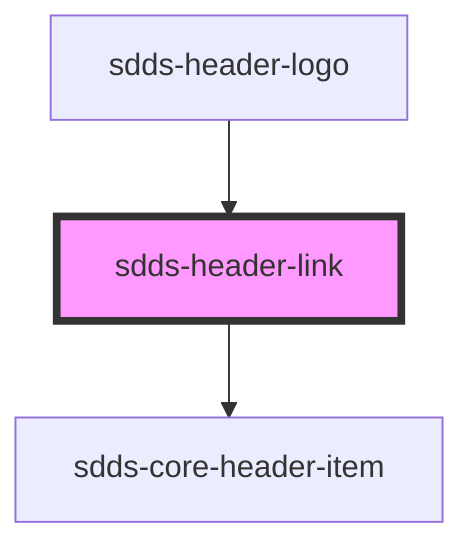

# sdds-header-link

The header link is a link that can be used to navigate to another page.

Example:

```html
<sdds-header-link href="https://www.scania.com" target="_blank">
  Link
</sdds-header-link>
```

Note: Any aria attributes will be passed to the underlying anchor tag.


<!-- Auto Generated Below -->


## Properties

| Property            | Attribute  | Description                                                                                                 | Type                                         | Default      |
| ------------------- | ---------- | ----------------------------------------------------------------------------------------------------------- | -------------------------------------------- | ------------ |
| `download`          | `download` | Native &lt;a&gt; tag attribute, see https://developer.mozilla.org/en-US/docs/Web/HTML/Element/a#attributes. | `string`                                     | `undefined`  |
| `href` _(required)_ | `href`     | The link URL.                                                                                               | `string`                                     | `undefined`  |
| `hreflang`          | `hreflang` | Native &lt;a&gt; tag attribute, see https://developer.mozilla.org/en-US/docs/Web/HTML/Element/a#attributes. | `string`                                     | `undefined`  |
| `rel`               | `rel`      | Native &lt;a&gt; tag attribute, see https://developer.mozilla.org/en-US/docs/Web/HTML/Element/a#attributes. | `string`                                     | `'noopener'` |
| `selected`          | `selected` | If the link should appear selected.                                                                         | `boolean`                                    | `false`      |
| `target`            | `target`   | Native &lt;a&gt; tag attribute, see https://developer.mozilla.org/en-US/docs/Web/HTML/Element/a#attributes. | `"_blank" \| "_parent" \| "_self" \| "_top"` | `undefined`  |


## Dependencies

### Used by

 - [sdds-header-logo](../header-logo)

### Depends on

- [sdds-core-header-item](../core-header-item)

### Graph


----------------------------------------------

*Built with [StencilJS](https://stenciljs.com/)*
