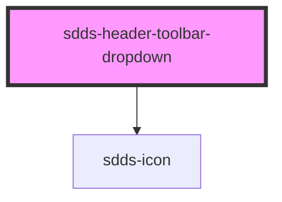

# sdds-header-toolbar-dropdown

<!-- Auto Generated Below -->

## Properties

| Property       | Attribute        | Description | Type      | Default                                            |
| -------------- | ---------------- | ----------- | --------- | -------------------------------------------------- |
| `avatar`       | `avatar`         |             | `boolean` | `false`                                            |
| `avatarImg`    | `avatar-img`     |             | `string`  | `'https://www.svgrepo.com/show/170303/avatar.svg'` |
| `avatarImgAlt` | `avatar-img-alt` |             | `string`  | `''`                                               |
| `fullHeight`   | `full-height`    |             | `boolean` | `false`                                            |
| `href`         | `href`           |             | `string`  | `''`                                               |
| `icon`         | `icon`           |             | `string`  | `'bento'`                                          |
| `open`         | `open`           |             | `boolean` | `false`                                            |
| `showOnMobile` | `show-on-mobile` |             | `boolean` | `false`                                            |

## Dependencies

### Depends on

- [sdds-icon](../../../icon)

### Graph

----------------------------------------------

*Built with [StencilJS](https://stenciljs.com/)*
