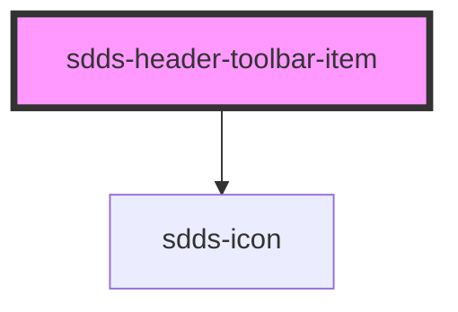

# sdds-header-toolbar-item

<!-- Auto Generated Below -->

## Properties

| Property       | Attribute        | Description | Type                 | Default    |
| -------------- | ---------------- | ----------- | -------------------- | ---------- |
| `href`         | `href`           |             | `string`             | `''`       |
| `icon`         | `icon`           |             | `string`             | `'truck'`  |
| `open`         | `open`           |             | `boolean`            | `false`    |
| `showOnMobile` | `show-on-mobile` |             | `boolean`            | `false`    |
| `type`         | `type`           |             | `"button" \| "link"` | `'button'` |

## Dependencies

### Depends on

- [sdds-icon](../../../icon)

### Graph

----------------------------------------------

*Built with [StencilJS](https://stenciljs.com/)*
