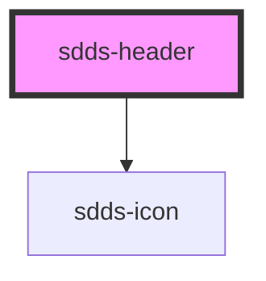

# sdds-header

<!-- Auto Generated Below -->

## Properties

| Property     | Attribute      | Description                                               | Type      | Default         |
| ------------ | -------------- | --------------------------------------------------------- | --------- | --------------- |
| `appName`    | `app-name`     | The name that is displayed in the header                  | `string`  | `'Application'` |
| `iconHref`   | `icon-href`    | Href for the header icon                                  | `string`  | `'#'`           |
| `mobileMenu` | `mobile-menu`  | Adds a mobilemenu button to the header on smaller screens | `boolean` | `true`          |
| `sideMenuId` | `side-menu-id` | The ID of the side menu that should act as mobile menu    | `string`  | `undefined`     |

## Events

| Event           | Description | Type               |
| --------------- | ----------- | ------------------ |
| `closeAllEvent` |             | `CustomEvent<any>` |

## Methods

### `closeChildren() => Promise<void>`

#### Returns

Type: `Promise<void>`

## Dependencies

### Depends on

- [sdds-icon](../../icon)

### Graph

----------------------------------------------

*Built with [StencilJS](https://stenciljs.com/)*
