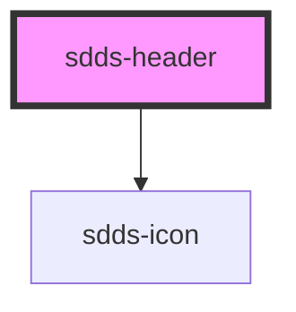

# sdds-header

<!-- Auto Generated Below -->

## Properties

| Property         | Attribute          | Description                              | Type      | Default         |
| ---------------- | ------------------ | ---------------------------------------- | --------- | --------------- |
| `iconHref`       | `icon-href`        | Href for the header icon                 | `string`  | `'#'`           |
| `mobileMenuOpen` | `mobile-menu-open` |                                          | `boolean` | `true`          |
| `siteName`       | `site-name`        | The name that is displayed in the header | `string`  | `'Application'` |

## Events

| Event           | Description | Type               |
| --------------- | ----------- | ------------------ |
| `closeAllEvent` |             | `CustomEvent<any>` |

## Methods

### `closeChildren() => Promise<void>`

#### Returns

Type: `Promise<void>`

## Dependencies

### Depends on

- [sdds-icon](../../icon)

### Graph

----------------------------------------------

*Built with [StencilJS](https://stenciljs.com/)*
