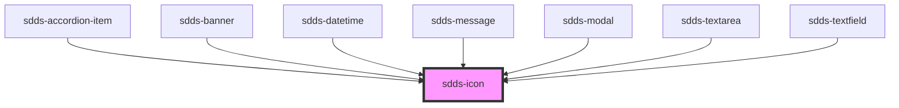

# sdds-icon

<!-- Auto Generated Below -->

## Properties

| Property | Attribute | Description                                                                                                                    | Type     | Default            |
| -------- | --------- | ------------------------------------------------------------------------------------------------------------------------------ | -------- | ------------------ |
| `name`   | `name`    | Pass a name of the icon. For icon names, refer to https://digitaldesign.scania.com/foundations/icons/icon-library or storybook | `string` | `'arrow_diagonal'` |
| `size`   | `size`    | Pass a size of icon as a string, for example: 32px, 1rem, 4em...                                                               | `string` | `'16px'`           |

## Dependencies

### Used by

 - [sdds-accordion-item](../accordion/accordion-item)
 - [sdds-banner](../banner)
 - [sdds-datetime](../datetime)
 - [sdds-message](../message)
 - [sdds-modal](../modal)
 - [sdds-textarea](../textarea)
 - [sdds-textfield](../textfield)

### Graph

----------------------------------------------

*Built with [StencilJS](https://stenciljs.com/)*
