# sdds-icon

<!-- Auto Generated Below -->

## Properties

| Property | Attribute | Description                                                                                                                    | Type     | Default            |
| -------- | --------- | ------------------------------------------------------------------------------------------------------------------------------ | -------- | ------------------ |
| `name`   | `name`    | Pass a name of the icon. For icon names, refer to https://digitaldesign.scania.com/foundations/icons/icon-library or storybook | `string` | `'arrow_diagonal'` |
| `size`   | `size`    | Pass a size of icon as a string, for example: 32px, 1rem, 4em...                                                               | `string` | `'16px'`           |

## Dependencies

### Used by

 - [sdds-accordion-item](../accordion/accordion-item)
 - [sdds-banner](../banner)
 - [sdds-datetime](../datetime)
 - [sdds-folder-tabs](../tabs/folder-tabs)
 - [sdds-footer-group](../footer/webcomponent/sdds-footer-group)
 - [sdds-inline-tabs](../tabs/inline-tabs)
 - [sdds-message](../message)
 - [sdds-modal](../modal)
 - [sdds-navigation-tabs](../tabs/navigation-tabs)
 - [sdds-slider](../slider)
 - [sdds-stepper-item](../stepper/stepper-item)
 - [sdds-textarea](../textarea)
 - [sdds-textfield](../textfield)
 - [sdds-toast](../toast)
 - [sdds-header-inline-menu-dropdown](../header/webcomponent/header-inline-menu-dropdown)
 - [sdds-header-launcher](../header/webcomponent/header-launcher)
 - [sdds-header-mobile-menu](../header/webcomponent/header-mobile-menu)
 - [sdds-header-mobile-menu-dropdown](../header/webcomponent/header-mobile-menu/header-mobile-menu-dropdown)

### Graph

```mermaid
graph TD;
  sdds-accordion-item --> sdds-icon
  sdds-banner --> sdds-icon
  sdds-datetime --> sdds-icon
  sdds-folder-tabs --> sdds-icon
  sdds-footer-group --> sdds-icon
  sdds-inline-tabs --> sdds-icon
  sdds-message --> sdds-icon
  sdds-modal --> sdds-icon
  sdds-navigation-tabs --> sdds-icon
  sdds-slider --> sdds-icon
  sdds-stepper-item --> sdds-icon
  sdds-textarea --> sdds-icon
  sdds-textfield --> sdds-icon
  sdds-toast --> sdds-icon
  sdds-header-inline-menu-dropdown --> sdds-icon
  sdds-header-launcher --> sdds-icon
  sdds-header-mobile-menu --> sdds-icon
  sdds-header-mobile-menu-dropdown --> sdds-icon
  style sdds-icon fill:#f9f,stroke:#333,stroke-width:4px
```

----------------------------------------------

*Built with [StencilJS](https://stenciljs.com/)*
