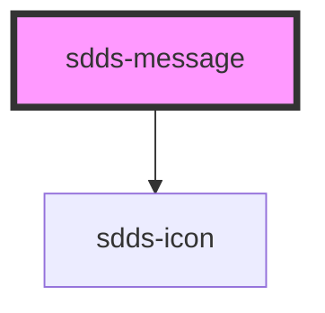

# sdds-message

<!-- Auto Generated Below -->

## Properties

| Property      | Attribute      | Description | Type                                                 | Default         |
| ------------- | -------------- | ----------- | ---------------------------------------------------- | --------------- |
| `header`      | `header`       |             | `string`                                             | `undefined`     |
| `minimal`     | `minimal`      |             | `boolean`                                            | `false`         |
| `modeVariant` | `mode-variant` |             | `"primary" \| "secondary"`                           | `'primary'`     |
| `noIcon`      | `no-icon`      |             | `boolean`                                            | `false`         |
| `type`        | `type`         |             | `"error" \| "information" \| "success" \| "warning"` | `'information'` |

## Dependencies

### Depends on

- [sdds-icon](../icon)

### Graph

----------------------------------------------

*Built with [StencilJS](https://stenciljs.com/)*
