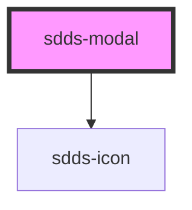

# sdds-modal

<!-- Auto Generated Below -->

## Properties

| Property  | Attribute | Description                                         | Type                           | Default    |
| --------- | --------- | --------------------------------------------------- | ------------------------------ | ---------- |
| `actions` | `actions` | Sticky or Static Actions                            | `"static" \| "sticky"`         | `'static'` |
| `open`    | `open`    |                                                     | `boolean`                      | `false`    |
| `prevent` | `prevent` | Disables closing modal on clicking on overlay area. | `boolean`                      | `false`    |
| `size`    | `size`    | Size of modal                                       | `"lg" \| "md" \| "sm" \| "xs"` | `'md'`     |

## Methods

### `closeModal() => Promise<void>`

Closes the modal.

#### Returns

Type: `Promise<void>`

### `showModal() => Promise<void>`

Shows the modal.

#### Returns

Type: `Promise<void>`

## Dependencies

### Depends on

- [sdds-icon](../icon)

### Graph

----------------------------------------------

*Built with [StencilJS](https://stenciljs.com/)*
