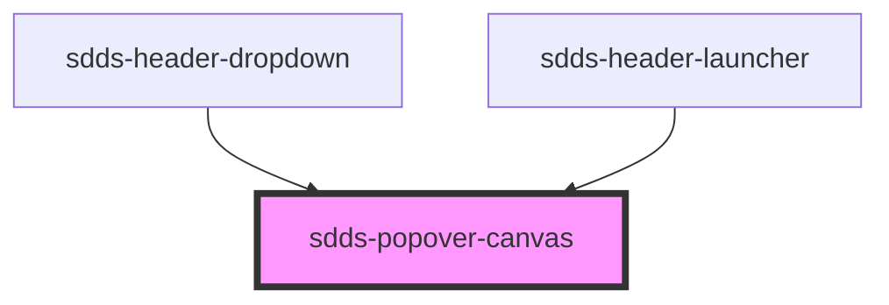

# sdds-popover-canvas

<!-- Auto Generated Below -->

## Properties

| Property         | Attribute         | Description                                                                                                                                                  | Type                                                                                                                                                                                                         | Default     |
| ---------------- | ----------------- | ------------------------------------------------------------------------------------------------------------------------------------------------------------ | ------------------------------------------------------------------------------------------------------------------------------------------------------------------------------------------------------------ | ----------- |
| `modifiers`      | --                | Array of modifier objects to pass to popper.js. See https://popper.js.org/docs/v2/modifiers/                                                                 | `Object[]`                                                                                                                                                                                                   | `[]`        |
| `offsetDistance` | `offset-distance` | Sets the offset distance                                                                                                                                     | `number`                                                                                                                                                                                                     | `8`         |
| `offsetSkidding` | `offset-skidding` | Sets the offset skidding                                                                                                                                     | `number`                                                                                                                                                                                                     | `0`         |
| `placement`      | `placement`       | Decides the placement of the Popover Canvas. See https://popper.js.org/docs/v2/constructors/#placement                                                       | `"auto" \| "auto-end" \| "auto-start" \| "bottom" \| "bottom-end" \| "bottom-start" \| "left" \| "left-end" \| "left-start" \| "right" \| "right-end" \| "right-start" \| "top" \| "top-end" \| "top-start"` | `'auto'`    |
| `referenceEl`    | --                | Element that will trigger the popover (takes priority over selector)                                                                                         | `HTMLElement`                                                                                                                                                                                                | `undefined` |
| `selector`       | `selector`        | The CSS-selector for an element that will trigger the popover                                                                                                | `string`                                                                                                                                                                                                     | `''`        |
| `show`           | `show`            | Controls wether the popover is shown or not. If this is set hiding and showing will be decided by this prop and will need to be controlled from the outside. | `boolean`                                                                                                                                                                                                    | `null`      |

## Dependencies

### Used by

 - [sdds-header-dropdown](../header/webcomponent/header-dropdown)
 - [sdds-header-launcher](../header/webcomponent/header-launcher)

### Graph

----------------------------------------------

*Built with [StencilJS](https://stenciljs.com/)*
