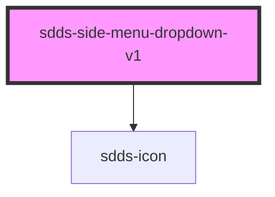

# sdds-side-menu-dropdown

<!-- Auto Generated Below -->

## Properties

| Property   | Attribute  | Description                  | Type      | Default |
| ---------- | ---------- | ---------------------------- | --------- | ------- |
| `open`     | `open`     | Open state for the dropdown. | `boolean` | `false` |
| `selected` | `selected` |                              | `boolean` | `false` |

## Dependencies

### Depends on

- [sdds-icon](../../../icon)

### Graph

----------------------------------------------

*Built with [StencilJS](https://stenciljs.com/)*
