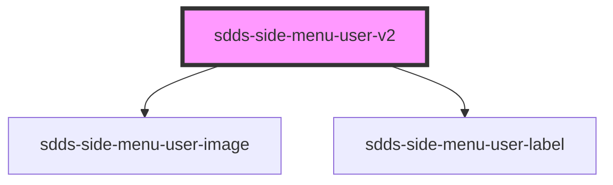

# sdds-side-menu-user-v2

<!-- Auto Generated Below -->

## Properties

| Property               | Attribute    | Description | Type     | Default     |
| ---------------------- | ------------ | ----------- | -------- | ----------- |
| `heading` _(required)_ | `heading`    |             | `string` | `undefined` |
| `imageAlt`             | `image-alt`  |             | `string` | `undefined` |
| `imageSrc`             | `image-src`  |             | `string` | `undefined` |
| `subheading`           | `subheading` |             | `string` | `undefined` |

## Dependencies

### Depends on

- [sdds-side-menu-user-image](../side-menu-user-image)
- [sdds-side-menu-user-label](../side-menu-user-label)

### Graph

----------------------------------------------

*Built with [StencilJS](https://stenciljs.com/)*
