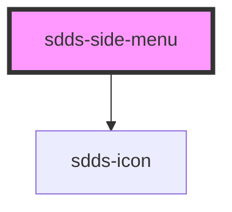

# sdds-side-menu

<!-- Auto Generated Below -->

## Properties

| Property         | Attribute          | Description                                                | Type      | Default        |
| ---------------- | ------------------ | ---------------------------------------------------------- | --------- | -------------- |
| `collapsable`    | `collapsable`      | Make the side menu collapsable                             | `boolean` | `false`        |
| `collapsed`      | `collapsed`        | Set the side menu as collapsed.                            | `boolean` | `false`        |
| `collapserIcon`  | `collapser-icon`   | Icon for the collapser, only needed if collapsable = true; | `string`  | `'arrow_left'` |
| `collapserText`  | `collapser-text`   | Text for the collapser, only needed if collapsable = true; | `string`  | `'Collapse'`   |
| `headerSideMenu` | `header-side-menu` | Should be true if the side menu is part of a header        | `boolean` | `false`        |

## Events

| Event                   | Description                                    | Type               |
| ----------------------- | ---------------------------------------------- | ------------------ |
| `collapseSideMenuEvent` | Broadcasts collapsed state to child components | `CustomEvent<any>` |

## Dependencies

### Depends on

- [sdds-icon](../../icon)

### Graph

----------------------------------------------

*Built with [StencilJS](https://stenciljs.com/)*
