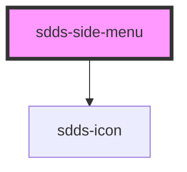

# sdds-side-menu

<!-- Auto Generated Below -->

## Properties

| Property        | Attribute        | Description | Type      | Default        |
| --------------- | ---------------- | ----------- | --------- | -------------- |
| `collapsable`   | `collapsable`    |             | `boolean` | `false`        |
| `collapsed`     | `collapsed`      |             | `boolean` | `false`        |
| `collapserIcon` | `collapser-icon` |             | `string`  | `'arrow_left'` |
| `collapserText` | `collapser-text` |             | `string`  | `'Collapse'`   |

## Events

| Event                   | Description                            | Type               |
| ----------------------- | -------------------------------------- | ------------------ |
| `collapseSideMenuEvent` | Broadcasts changes to the tables props | `CustomEvent<any>` |

## Dependencies

### Depends on

- [sdds-icon](../../icon)

### Graph

----------------------------------------------

*Built with [StencilJS](https://stenciljs.com/)*
