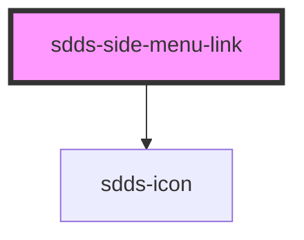

# sdds-side-menu-button

<!-- Auto Generated Below -->

## Properties

| Property | Attribute | Description                            | Type     | Default |
| -------- | --------- | -------------------------------------- | -------- | ------- |
| `href`   | `href`    | Href for side menu item that are links | `string` | `'#'`   |
| `icon`   | `icon`    | Icon for the side menu item            | `string` | `''`    |

## Dependencies

### Depends on

- [sdds-icon](../../../icon)

### Graph

----------------------------------------------

*Built with [StencilJS](https://stenciljs.com/)*
