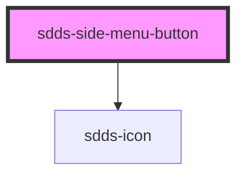

# sdds-side-menu-button

<!-- Auto Generated Below -->

## Properties

| Property   | Attribute  | Description                              | Type      | Default |
| ---------- | ---------- | ---------------------------------------- | --------- | ------- |
| `icon`     | `icon`     | Icon for the side menu item              | `string`  | `''`    |
| `selected` | `selected` | Sets the button as into a selected state | `boolean` | `false` |

## Dependencies

### Depends on

- [sdds-icon](../../../icon)

### Graph

----------------------------------------------

*Built with [StencilJS](https://stenciljs.com/)*
