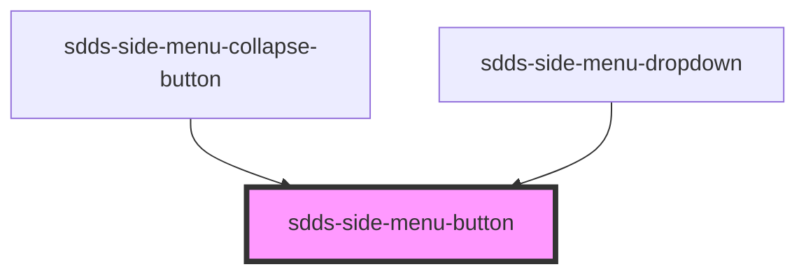

# sdds-side-menu-button

<!-- Auto Generated Below -->

## Properties

| Property   | Attribute  | Description                               | Type      | Default |
| ---------- | ---------- | ----------------------------------------- | --------- | ------- |
| `selected` | `selected` | Gives the appearance of a selected button | `boolean` | `false` |

## Dependencies

### Used by

 - [sdds-side-menu-collapse-button](../side-menu-collapse-button)
 - [sdds-side-menu-dropdown](../side-menu-dropdown)

### Graph

----------------------------------------------

*Built with [StencilJS](https://stenciljs.com/)*
