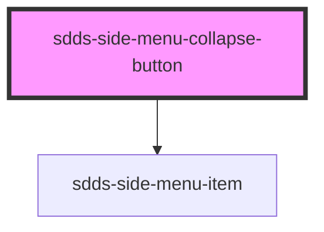

# sdds-side-menu-collapse-button

The side menu collapse button is a button that can be used to collapse the side menu when the side-menu is in the `persistent` mode.

Example:

```html
<sdds-side-menu-collapse-button></sdds-side-menu-collapse-button>
```

<!-- Auto Generated Below -->


## Events

| Event          | Description                                                                                                                                                      | Type                                   |
| -------------- | ---------------------------------------------------------------------------------------------------------------------------------------------------------------- | -------------------------------------- |
| `sddsCollapse` | Event that is broadcasted when the collapse button is clicked. Prevent it to disable automatic collapsing, and set the collapsed prop on the side menu yourself. | `CustomEvent<{ collapsed: boolean; }>` |


## Dependencies

### Depends on

- [sdds-side-menu-item](../side-menu-item)

### Graph


----------------------------------------------

*Built with [StencilJS](https://stenciljs.com/)*
