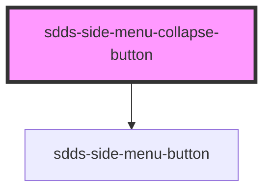

# sdds-side-menu-collapse-button

The side menu collapse button is a button that can be used to collapse the side menu when the side-menu is in the `persistent` mode.

Example:

```html
<sdds-side-menu-collapse-button></sdds-side-menu-collapse-button>
```

<!-- Auto Generated Below -->


## Dependencies

### Depends on

- [sdds-side-menu-button](../side-menu-button)

### Graph


----------------------------------------------

*Built with [StencilJS](https://stenciljs.com/)*
