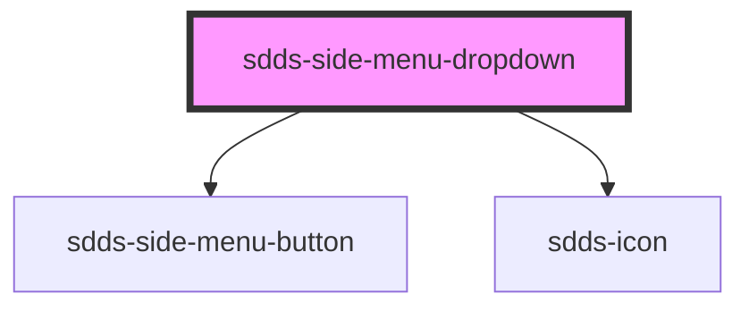

# sdds-side-menu-dropdown

<!-- Auto Generated Below -->

## Properties

| Property      | Attribute      | Description                                                                                       | Type      | Default     |
| ------------- | -------------- | ------------------------------------------------------------------------------------------------- | --------- | ----------- |
| `buttonLabel` | `button-label` | The label of the button that opens the dropdown. This is an alternative to the button-label slot. | `string`  | `undefined` |
| `initialOpen` | `initial-open` | If the dropdown should be open from the start.                                                    | `boolean` | `false`     |
| `selected`    | `selected`     | If the button that opens the dropdown should appear selected.                                     | `boolean` | `false`     |

## Dependencies

### Depends on

- [sdds-side-menu-button](../side-menu-button)
- [sdds-icon](../../../icon)

### Graph

----------------------------------------------

*Built with [StencilJS](https://stenciljs.com/)*
