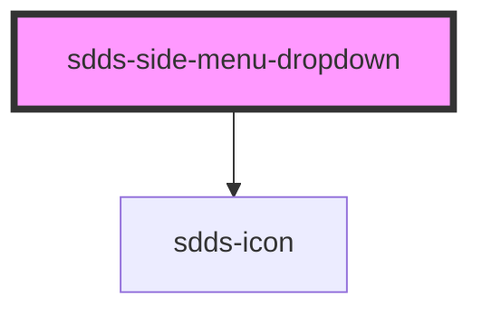

# sdds-side-menu-dropdown

<!-- Auto Generated Below -->

## Properties

| Property | Attribute | Description                     | Type      | Default |
| -------- | --------- | ------------------------------- | --------- | ------- |
| `open`   | `open`    | Open state for the dropdown.    | `boolean` | `false` |
| `text`   | `text`    | Text for the side menu dropdown | `string`  | `''`    |

## Dependencies

### Depends on

- [sdds-icon](../../../icon)

### Graph

----------------------------------------------

*Built with [StencilJS](https://stenciljs.com/)*
