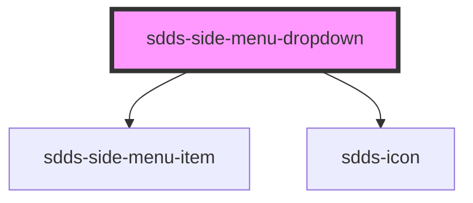

# sdds-side-menu-dropdown

The side menu dropdown is a container for navigation items.

Example:

```html
<sdds-side-menu-dropdown
  button-label="Dropdown"
>
  <sdds-icon slot="button-icon" name="star" size="24"></sdds-icon>
  <span slot="button-label">Button label</span>
  <sdds-side-menu-dropdown-list>
    <sdds-side-menu-dropdown-list-item>
      <a href="#">Link 1</a>
    </sdds-side-menu-dropdown-list-item>
    <sdds-side-menu-dropdown-list-item selected="true">
      <a href="#">Link 2</a>
    </sdds-side-menu-dropdown-list-item>
    <sdds-side-menu-dropdown-list-item>
      <a href="#">Link 3</a>
    </sdds-side-menu-dropdown-list-item>
  </sdds-side-menu-dropdown-list>
</sdds-side-menu-dropdown>
```


<!-- Auto Generated Below -->


## Properties

| Property      | Attribute      | Description                                                                                       | Type      | Default     |
| ------------- | -------------- | ------------------------------------------------------------------------------------------------- | --------- | ----------- |
| `buttonLabel` | `button-label` | The label of the button that opens the dropdown. This is an alternative to the button-label slot. | `string`  | `undefined` |
| `defaultOpen` | `default-open` | If the dropdown should be open from the start.                                                    | `boolean` | `false`     |
| `selected`    | `selected`     | If the button that opens the dropdown should appear selected.                                     | `boolean` | `false`     |


## Dependencies

### Depends on

- [sdds-side-menu-item](../side-menu-item)
- [sdds-icon](../../../icon)

### Graph


----------------------------------------------

*Built with [StencilJS](https://stenciljs.com/)*
