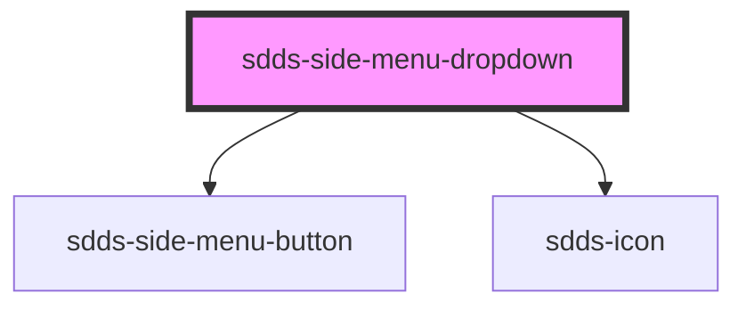

# sdds-side-menu-dropdown

<!-- Auto Generated Below -->

## Properties

| Property      | Attribute      | Description                                                | Type               | Default     |
| ------------- | -------------- | ---------------------------------------------------------- | ------------------ | ----------- |
| `active`      | `active`       |                                                            | `boolean`          | `false`     |
| `buttonLabel` | `button-label` |                                                            | `string`           | `undefined` |
| `open`        | `open`         | Opens and closes the dropdown                              | `boolean`          | `false`     |
| `placement`   | `placement`    | Placement of the dropdown menu relative to the button TODO | `"end" \| "start"` | `'start'`   |

## Dependencies

### Depends on

- [sdds-side-menu-button](../side-menu-button)
- [sdds-icon](../../../icon)

### Graph

----------------------------------------------

*Built with [StencilJS](https://stenciljs.com/)*
