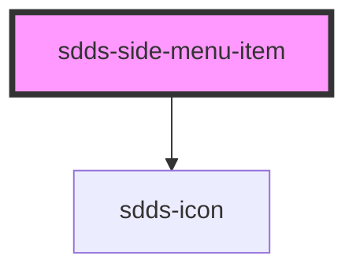

# sdds-side-menu-item

<!-- Auto Generated Below -->

## Properties

| Property          | Attribute          | Description | Type                                   | Default                                            |
| ----------------- | ------------------ | ----------- | -------------------------------------- | -------------------------------------------------- |
| `avatarHeader`    | `avatar-header`    |             | `string`                               | `''`                                               |
| `avatarImg`       | `avatar-img`       |             | `string`                               | `'https://www.svgrepo.com/show/170303/avatar.svg'` |
| `avatarImgAlt`    | `avatar-img-alt`   |             | `string`                               | `''`                                               |
| `avatarSubheader` | `avatar-subheader` |             | `string`                               | `''`                                               |
| `href`            | `href`             |             | `string`                               | `'#'`                                              |
| `icon`            | `icon`             |             | `string`                               | `''`                                               |
| `position`        | `position`         |             | `"bottom" \| "top"`                    | `'top'`                                            |
| `text`            | `text`             |             | `string`                               | `''`                                               |
| `type`            | `type`             |             | `"button" \| "link" \| "user-profile"` | `'link'`                                           |

## Dependencies

### Depends on

- [sdds-icon](../../../icon)

### Graph

----------------------------------------------

*Built with [StencilJS](https://stenciljs.com/)*
