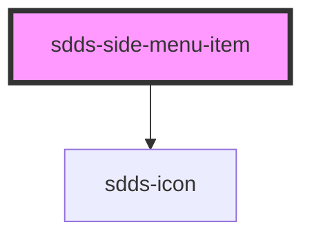

# sdds-side-menu-item

<!-- Auto Generated Below -->

## Properties

| Property          | Attribute          | Description                                                     | Type                                   | Default                                            |
| ----------------- | ------------------ | --------------------------------------------------------------- | -------------------------------------- | -------------------------------------------------- |
| `avatarHeader`    | `avatar-header`    | Header for image for side menu items that are 'user-profile'    | `string`                               | `''`                                               |
| `avatarImg`       | `avatar-img`       | Image for side menu items that are 'user-profile'               | `string`                               | `'https://www.svgrepo.com/show/170303/avatar.svg'` |
| `avatarImgAlt`    | `avatar-img-alt`   | Alt for image for side menu items that are 'user-profile'       | `string`                               | `''`                                               |
| `avatarSubheader` | `avatar-subheader` | Subheader for image for side menu items that are 'user-profile' | `string`                               | `''`                                               |
| `href`            | `href`             | Href for side menu item that are links                          | `string`                               | `'#'`                                              |
| `icon`            | `icon`             | Icon for the side menu item                                     | `string`                               | `''`                                               |
| `text`            | `text`             | Text for the side menu item                                     | `string`                               | `''`                                               |
| `type`            | `type`             | Type of side menu item.                                         | `"button" \| "link" \| "user-profile"` | `'link'`                                           |

## Dependencies

### Depends on

- [sdds-icon](../../../icon)

### Graph

----------------------------------------------

*Built with [StencilJS](https://stenciljs.com/)*
