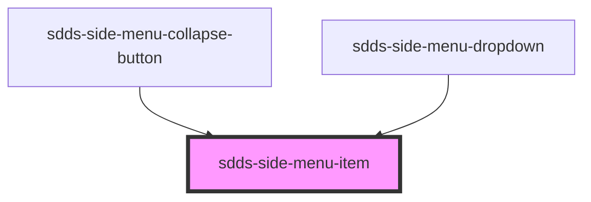

# sdds-side-menu-item

<!-- Auto Generated Below -->

## Properties

| Property   | Attribute  | Description                                                                                                                  | Type      | Default |
| ---------- | ---------- | ---------------------------------------------------------------------------------------------------------------------------- | --------- | ------- |
| `active`   | `active`   | If the item should appear active. Can be used when the item is triggering a dropdown, and the dropdown is open, for example. | `boolean` | `false` |
| `selected` | `selected` | If the item should appear selected.                                                                                          | `boolean` | `false` |

## Dependencies

### Used by

 - [sdds-side-menu-collapse-button](../side-menu-collapse-button)
 - [sdds-side-menu-dropdown](../side-menu-dropdown)

### Graph

----------------------------------------------

*Built with [StencilJS](https://stenciljs.com/)*
