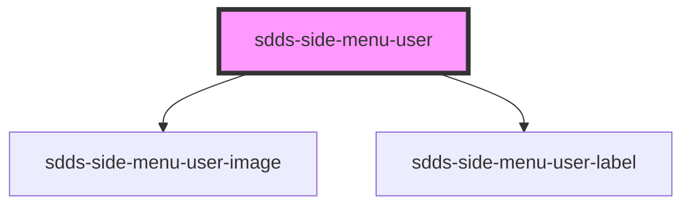

# sdds-side-menu-user

<!-- Auto Generated Below -->

## Properties

| Property               | Attribute    | Description          | Type     | Default     |
| ---------------------- | ------------ | -------------------- | -------- | ----------- |
| `heading` _(required)_ | `heading`    | The heading text.    | `string` | `undefined` |
| `imageAlt`             | `image-alt`  | The image alt text.  | `string` | `undefined` |
| `imageSrc`             | `image-src`  | The image source.    | `string` | `undefined` |
| `subheading`           | `subheading` | The subheading text. | `string` | `undefined` |

## Dependencies

### Depends on

- [sdds-side-menu-user-image](../side-menu-user-image)
- [sdds-side-menu-user-label](../side-menu-user-label)

### Graph

----------------------------------------------

*Built with [StencilJS](https://stenciljs.com/)*
