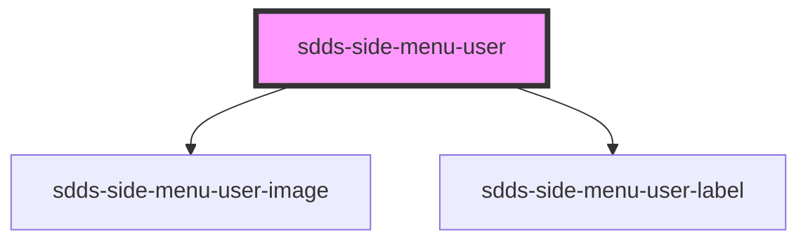

# sdds-side-menu-user

The side menu user component is a container for the user image and label(s).

Example:
  
  ```html
  <sdds-side-menu-user
  img-src="https://via.placeholder.com/150"
  img-alt="User image"
  heading="John Doe"
  subheading=""
></sdds-side-menu-user>
  ```


<!-- Auto Generated Below -->


## Properties

| Property               | Attribute    | Description          | Type     | Default     |
| ---------------------- | ------------ | -------------------- | -------- | ----------- |
| `heading` _(required)_ | `heading`    | The heading text.    | `string` | `undefined` |
| `imgAlt`               | `img-alt`    | The image alt text.  | `string` | `undefined` |
| `imgSrc`               | `img-src`    | The image source.    | `string` | `undefined` |
| `subheading`           | `subheading` | The subheading text. | `string` | `undefined` |


## Dependencies

### Depends on

- [sdds-side-menu-user-image](../side-menu-user-image)
- [sdds-side-menu-user-label](../side-menu-user-label)

### Graph


----------------------------------------------

*Built with [StencilJS](https://stenciljs.com/)*
