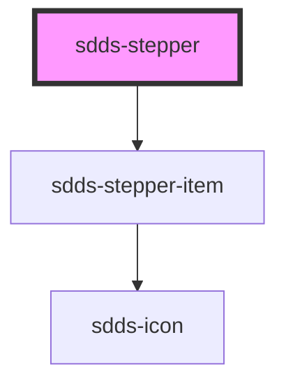

# sdds-stepper

<!-- Auto Generated Below -->

## Properties

| Property        | Attribute        | Description                                           | Type                         | Default        |
| --------------- | ---------------- | ----------------------------------------------------- | ---------------------------- | -------------- |
| `direction`     | `direction`      | The direction the children are layed out.             | `"horizontal" \| "vertical"` | `'horizontal'` |
| `hideLabels`    | `hide-labels`    | Hides the label for the child components if true.     | `boolean`                    | `false`        |
| `labelPosition` | `label-position` | Text position, only available on direction:horizontal | `"aside" \| "below"`         | `'below'`      |
| `size`          | `size`           | Size of the component and it's children.              | `"lg" \| "sm"`               | `'lg'`         |

## Dependencies

### Depends on

- [sdds-stepper-item](stepper-item)

### Graph

----------------------------------------------

*Built with [StencilJS](https://stenciljs.com/)*
