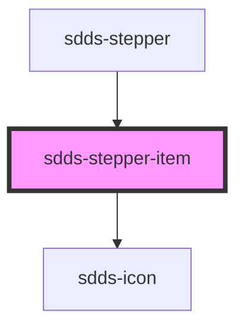

# sdds-stepper-item

<!-- Auto Generated Below -->

## Properties

| Property          | Attribute           | Description                      | Type                                              | Default      |
| ----------------- | ------------------- | -------------------------------- | ------------------------------------------------- | ------------ |
| `ariaDescribedBy` | `aria-described-by` | ALIGN ON THIS DESCRIPTION        | `string`                                          | `undefined`  |
| `arialabelledBy`  | `arialabelled-by`   | ALIGN ON THIS DESCRIPTION        | `string`                                          | `undefined`  |
| `direction`       | `direction`         |                                  | `string`                                          | `undefined`  |
| `hideLabel`       | `hide-label`        |                                  | `boolean`                                         | `undefined`  |
| `labelPosition`   | `label-position`    |                                  | `string`                                          | `undefined`  |
| `labelText`       | `label-text`        | Label text for the stepper-item. | `string`                                          | `''`         |
| `position`        | `position`          |                                  | `string`                                          | `undefined`  |
| `size`            | `size`              |                                  | `string`                                          | `undefined`  |
| `state`           | `state`             | State of the stepper-item        | `"current" \| "error" \| "success" \| "upcoming"` | `'upcoming'` |

## Dependencies

### Used by

 - [sdds-stepper](..)

### Depends on

- [sdds-icon](../../icon)

### Graph

----------------------------------------------

*Built with [StencilJS](https://stenciljs.com/)*
