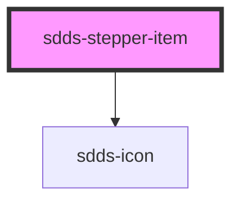

# sdds-stepper-item

<!-- Auto Generated Below -->

## Properties

| Property    | Attribute    | Description                      | Type                                              | Default      |
| ----------- | ------------ | -------------------------------- | ------------------------------------------------- | ------------ |
| `labelText` | `label-text` | Label text for the stepper-item. | `string`                                          | `''`         |
| `state`     | `state`      | State of the stepper-item        | `"current" \| "error" \| "success" \| "upcoming"` | `'upcoming'` |

## Methods

### `setWidth(width: any) => Promise<void>`

Method to set the width if the stepper item based on its siblings widht, used by the parent element.

#### Returns

Type: `Promise<void>`

## Dependencies

### Depends on

- [sdds-icon](../../icon)

### Graph

----------------------------------------------

*Built with [StencilJS](https://stenciljs.com/)*
