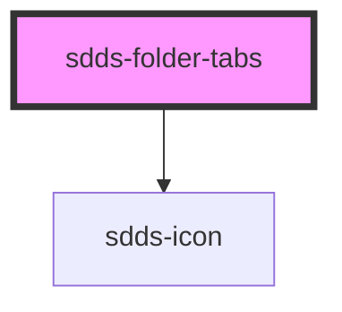

# sdds-inline-tabs

<!-- Auto Generated Below -->

## Properties

| Property      | Attribute      | Description                                                                                       | Type                       | Default     |
| ------------- | -------------- | ------------------------------------------------------------------------------------------------- | -------------------------- | ----------- |
| `defaultTab`  | `default-tab`  | either use this (default-tab="...") or read attribute "default" from one of the slotted children. | `string`                   | `undefined` |
| `modeVariant` | `mode-variant` | Variant of the tabs, primary= on white, secondary= on grey50                                      | `"primary" \| "secondary"` | `null`      |

## Events

| Event                      | Description | Type                                                              |
| -------------------------- | ----------- | ----------------------------------------------------------------- |
| `sddsFolderTabChangeEvent` |             | `CustomEvent<{ selectedTab: string; selectedTabIndex: number; }>` |

## Dependencies

### Depends on

- [sdds-icon](../../icon)

### Graph

----------------------------------------------

*Built with [StencilJS](https://stenciljs.com/)*
