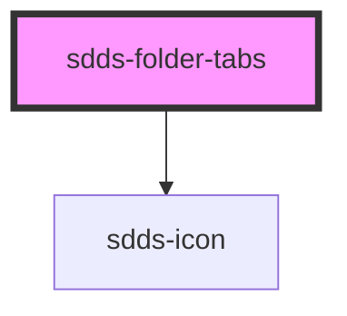

# sdds-inline-tabs

<!-- Auto Generated Below -->

## Properties

| Property      | Attribute      | Description                                                  | Type                       | Default |
| ------------- | -------------- | ------------------------------------------------------------ | -------------------------- | ------- |
| `modeVariant` | `mode-variant` | Variant of the tabs, primary= on white, secondary= on grey50 | `"primary" \| "secondary"` | `null`  |

## Events

| Event                | Description | Type                                                              |
| -------------------- | ----------- | ----------------------------------------------------------------- |
| `sddsTabChangeEvent` |             | `CustomEvent<{ selectedTab: string; selectedTabIndex: number; }>` |

## Methods

### `selectTab(tabIndex: number) => Promise<{ selectedTab: string; selectedTabIndex: number; }>`

Sets the passed tabindex as the selected tab.

#### Returns

Type: `Promise<{ selectedTab: string; selectedTabIndex: number; }>`

## Dependencies

### Depends on

- [sdds-icon](../../icon)

### Graph

----------------------------------------------

*Built with [StencilJS](https://stenciljs.com/)*
