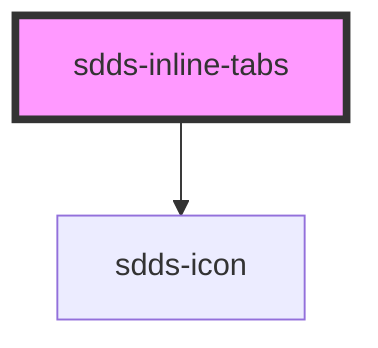

# sdds-inline-tabs

<!-- Auto Generated Below -->

## Properties

| Property      | Attribute      | Description                                                  | Type                       | Default     |
| ------------- | -------------- | ------------------------------------------------------------ | -------------------------- | ----------- |
| `modeVariant` | `mode-variant` | Variant of the tabs, primary= on white, secondary= on grey50 | `"primary" \| "secondary"` | `'primary'` |

## Events

| Event        | Description | Type                                                                |
| ------------ | ----------- | ------------------------------------------------------------------- |
| `sddsChange` |             | `CustomEvent<{ selectedTab: { tab: string; tabIndex: number; }; }>` |

## Methods

### `selectTab(tabIndex: number) => Promise<{ selectedTab: string; selectedTabIndex: number; }>`

Selects a tab based on tabindex, will not select a disabled tab.

#### Returns

Type: `Promise<{ selectedTab: string; selectedTabIndex: number; }>`

## Dependencies

### Depends on

- [sdds-icon](../../icon)

### Graph

----------------------------------------------

*Built with [StencilJS](https://stenciljs.com/)*
