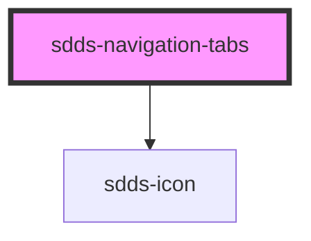

# sdds-navigation-tabs

This component neither accepts any properties, nor exposes any methods.

<!-- Auto Generated Below -->

## Properties

| Property               | Attribute                | Description                                                                            | Type                       | Default     |
| ---------------------- | ------------------------ | -------------------------------------------------------------------------------------- | -------------------------- | ----------- |
| `defaultSelectedIndex` | `default-selected-index` | Sets the default selected tab.                                                         | `number`                   | `0`         |
| `modeVariant`          | `mode-variant`           | Variant of the tabs, primary= on white, secondary= on grey50                           | `"primary" \| "secondary"` | `'primary'` |
| `selectedIndex`        | `selected-index`         | Sets the selected tab. If this is set all tab changes needs to be handled by the user. | `number`                   | `undefined` |

## Events

| Event        | Description                                     | Type                                         |
| ------------ | ----------------------------------------------- | -------------------------------------------- |
| `sddsChange` | Event emitted when the selected tab is changed. | `CustomEvent<{ selectedTabIndex: number; }>` |

## Methods

### `selectTab(tabIndex: number) => Promise<{ selectedTabIndex: number; }>`

Sets the passed tabindex as the selected tab.

#### Returns

Type: `Promise<{ selectedTabIndex: number; }>`

## Dependencies

### Depends on

- [sdds-icon](../../icon)

### Graph

----------------------------------------------

*Built with [StencilJS](https://stenciljs.com/)*
