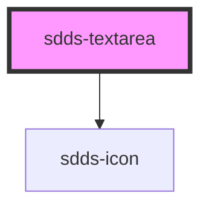

# sdds-textarea

<!-- Auto Generated Below -->

## Properties

| Property        | Attribute        | Description                              | Type                                  | Default      |
| --------------- | ---------------- | ---------------------------------------- | ------------------------------------- | ------------ |
| `autoFocus`     | `auto-focus`     | Control of autofocus                     | `boolean`                             | `false`      |
| `cols`          | `cols`           | Textarea cols attribute                  | `number`                              | `undefined`  |
| `disabled`      | `disabled`       | Set input in disabled state              | `boolean`                             | `false`      |
| `helper`        | `helper`         | Helper text                              | `string`                              | `undefined`  |
| `label`         | `label`          | Label text                               | `string`                              | `''`         |
| `labelPosition` | `label-position` | Position of the label for the textfield. | `"inside" \| "no-label" \| "outside"` | `'no-label'` |
| `maxLength`     | `max-length`     | Max length of input                      | `number`                              | `undefined`  |
| `modeVariant`   | `mode-variant`   | Mode variant of the textarea             | `"primary" \| "secondary"`            | `null`       |
| `name`          | `name`           | Name attribute                           | `string`                              | `''`         |
| `noMinWidth`    | `no-min-width`   | Unset minimum width of 208px.            | `boolean`                             | `false`      |
| `placeholder`   | `placeholder`    | Placeholder text                         | `string`                              | `''`         |
| `readOnly`      | `read-only`      | Set input in readonly state              | `boolean`                             | `false`      |
| `rows`          | `rows`           | Textarea rows attribute                  | `number`                              | `undefined`  |
| `state`         | `state`          | Error state of input                     | `"default" \| "error" \| "success"`   | `'default'`  |
| `value`         | `value`          | Value of the input text                  | `string`                              | `''`         |

## Events

| Event        | Description                   | Type                      |
| ------------ | ----------------------------- | ------------------------- |
| `sddsBlur`   | Blur event for the textarea   | `CustomEvent<FocusEvent>` |
| `sddsChange` | Change event for the textarea | `CustomEvent<any>`        |
| `sddsFocus`  | Focus event for the textarea  | `CustomEvent<FocusEvent>` |
| `sddsInput`  | Input event for the textarea  | `CustomEvent<InputEvent>` |

## Dependencies

### Depends on

- [sdds-icon](../icon)

### Graph

----------------------------------------------

*Built with [StencilJS](https://stenciljs.com/)*
