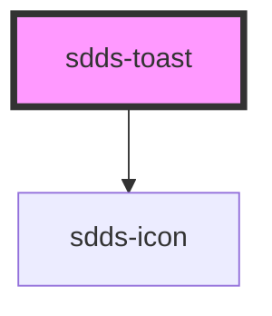

# sdds-toast

<!-- Auto Generated Below -->

## Properties

| Property    | Attribute    | Description                                            | Type                                                 | Default               |
| ----------- | ------------ | ------------------------------------------------------ | ---------------------------------------------------- | --------------------- |
| `header`    | `header`     | Header text for the component.                         | `string`                                             | `undefined`           |
| `hidden`    | `hidden`     | Hides the toast.                                       | `boolean`                                            | `false`               |
| `subheader` | `subheader`  | Subheader text for the component.                      | `string`                                             | `undefined`           |
| `toastId`   | `toast-id`   | ID for the toast. Randomly generated if not specified. | `string`                                             | `crypto.randomUUID()` |
| `toastRole` | `toast-role` | ARIA role for the toast.                               | `"alert" \| "log" \| "status"`                       | `'alert'`             |
| `type`      | `type`       | Type of toast.                                         | `"error" \| "information" \| "success" \| "warning"` | `'information'`       |

## Events

| Event       | Description                                        | Type                                |
| ----------- | -------------------------------------------------- | ----------------------------------- |
| `sddsClose` | Sends unique toast identifier component is closed. | `CustomEvent<{ toastId: string; }>` |

## Methods

### `hideToast() => Promise<void>`

Hides the toast.

#### Returns

Type: `Promise<void>`

### `showToast() => Promise<void>`

Shows the toast.

#### Returns

Type: `Promise<void>`

## Dependencies

### Depends on

- [sdds-icon](../icon)

### Graph

----------------------------------------------

*Built with [StencilJS](https://stenciljs.com/)*
